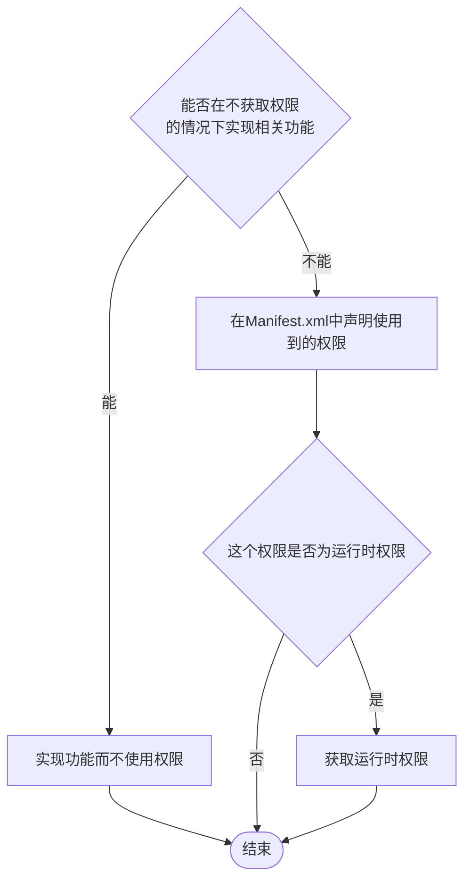
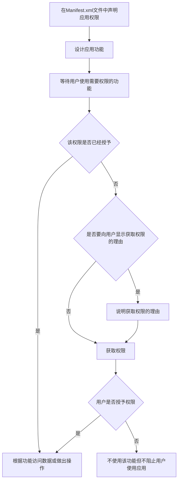

### 概述

应用权限有助于保护对以下数据和操作的访问/执行权限，从而为保护用户隐私提供支持：

- **受限数据**，例如系统状态和用户的联系信息
- **受限操作**，例如连接到已配对的设备并录制音频

获取应用权限的工作流程：



应用权限有三种类型：

1. 安装时权限：在安装应用时自动授予的权限，这种权限允许应用对部分数据进行受限制的访问，或者允许应用执行对系统或其他应用有最低影响的操作
2. 运行时权限：在应用运行时由用户授予的权限，也叫做**危险权限**。这种权限允许应用访问绝大部分数据（有时包括私人数据），或者允许应用执行绝大部分操作。因此，您需要先在应用中请求运行时权限，然后才能访问受限数据或执行受限操作
3. 特殊权限：与特定的应用操作对应的的权限，这种权限只有平台和原始设备制造商 (OEM) 可以定义

授予对应类型的权限就代表应用可以访问对应范围的数据，以及可以执行对应范围的操作。

> 对于每一项权限的保护级别，参见[权限API参考文档](https://developer.android.google.cn/reference/android/Manifest.permission)

### 声明权限

如果应用需要请求权限，那么就应该在 AndroidManifest.xml 中声明权限

Manifest.xml 使用 `<uses-permission>` 标签添加权限元素：

```XML
<?xml version="1.0" encoding="utf-8"?>
<manifest xmlns:android="http://schemas.android.com/apk/res/android"
    xmlns:tools="http://schemas.android.com/tools">

    <!-- 在清单中声明蓝牙权限 -->
    <uses-permission android:name="android.permission.BLUETOOTH" />

    <application ...>
    	...
    </application>
</manifest>
```

#### 特殊硬件权限的声明

有些权限需要访问只能在部分设备上使用的特殊硬件（比如三星的spen），如果应用声明了这些权限，这时候就需要考虑应用能否在没有这种硬件的设备上正常运行。因此可以使用 `<uses-feature>` 标签，并将其中的 `android:required` 属性设置为false，这样就可以兼容没有特殊硬件的设备了（不然应用就必须要在有特殊硬件的情况下才能运行）

```xml
<!-- 以相机为例，将相机设置为可选硬件，并获取权限 -->
<uses-permission android:name="android.permission.CAMERA" />
<uses-feature android:name="android.hardware.camera"
    android:required="false" />
```

在这种情况下，可能需要禁用应用中的某些功能，这时候可以使用 hasSystemFeature() 方法来检查设备是否具有特殊硬件

```java
// e.g. 检查设备是否有前置摄像头
if (getApplicationContext().getPackageManager().hasSystemFeature(
        PackageManager.FEATURE_CAMERA_FRONT)) {
    // 启用前置摄像头功能
} else {
    // 阉割前置摄像头功能
}
```

#### 安卓 6.0 及以上版本权限的声明

运行时权限是在安卓 6.0 及以上版本出现的（之前这类权限在安装或更新应用时就已经授予了），所以针对支持运行时权限的设备声明权限时，可以使用 `<uses-permission-sdk-23>` （ 而非 `<uses-permission>` ）标签声明权限

此外，使用这两个元素中的任意一个时，都可以设置 `maxSdkVersion` 属性，这样应用在高于指定SDK版本上运行时，就不会获取这个权限

```xml
<!-- 在sdk版本高于32（安卓12）的设备上，应用不会获取相机权限 -->
<uses-permission-sdk-23 android:name="android.permission.CAMERA"
    android:maxSdkVersion="32"/>
```

### 请求权限

除了安装时权限以外，所有类型的权限都需要请求并由用户授权

请求权限有以下基本原则：

- 只有当用户使用需要相关权限的功能时，才请求权限
- 始终提供选项供用户取消指导界面流程，也就是允许用户跳过引导设置
- 如果用户拒绝或撤消某项功能所需的权限，可以禁用需要该权限的功能，但不能不让用户继续使用应用
- 不要对系统行为做任何假设。例如，假设某些权限会出现在同一个权限组中。

请求权限的工作流程：



#### 检查权限是否授予

在 Activity.java 中使用 ContextCompat.checkSelfPermission() 方法来确定应用是否已经获得权限

```java
// public static int checkSelfPermission(Context context, String permission)
// context 指需要获取权限的 Activity，permission 可以在 Manifest.permission 类中调用
// 返回值为 PackageManager.PERMISSION_DENIED 或 PackageManager.PERMISSION_GRANTED

if (ContextCompat.checkSelfPermission(MainActivity.this, Manifest.permission.CAMERA) == PackageManager.PERMISSION_DENIED) {
    tv.setText("相机权限没有授予");
}
```

#### 请求并获取权限

传统上，使用 requestPermissions() 方法请求权限，并在 Activity 类中实现 onRequsetPermissionsResult() 方法来处理权限请求响应

```java
public class Main2Activity extends AppCompatActivity {

    TextView tv;

    @Override
    protected void onCreate(Bundle savedInstanceState) {
        // 略去其他代码
        
        // 在按钮的点击事件中获取权限
        permissionBtn.setOnClickListener(new View.OnClickListener() {
            @Override
            public void onClick(View v) {
                if (checkSelfPermission(Manifest.permission.CAMERA) == PackageManager.PERMISSION_DENIED) {
                    tv.setText("尝试获取相机权限");
                    
                    // 使用 ActivityCompat.requestPermissions 方法获取权限
                    ActivityCompat.requestPermissions(Main2Activity.this, new String[]{Manifest.permission.CAMERA}, 1);
                    //  这里的“1”为请求代码，可以自定义
                }
            }
        });
    }

    // 实现 onRequestPermissionsResult 方法，处理权限请求响应
    // 系统会传入用户对权限对话框的响应以及自定义的请求代码
    @Override
    public void onRequestPermissionsResult(int requestCode, @NonNull String[] permissions, @NonNull int[] grantResults, int deviceId) {
        if (requestCode == 1) {
            if (grantResults.length > 0 && grantResults[0] == PackageManager.PERMISSION_GRANTED) {
                tv.setText("权限获取成功");
            } else {
                tv.setText("权限获取失败");
            }
        }
    }
}
```

但是在新版 API 中，建议通过 ActivityResultLauncher 类和回调机制请求和处理权限相关问题，这里不做叙述（其实是我不会，但后面会补的）

### 如果权限请求遭到拒绝

如果用户拒绝了权限请求，您的应用必须帮助他们了解拒绝授予权限的影响。具体而言，应用必须让用户知道因缺少权限而无法使用哪些功能。在处理这种情况时，请牢记以下最佳做法：

- **尽可能减少功能损失。**用户应能够在不具备所请求权限的情况下，尽可能访问应用。如果功能在一定程度上可以正常运行，即使与获得相应权限后可能实现的效果相比有所下降，最好还是保持开启状态。
- **引导用户的注意力**。在应用界面中突出显示因为应用没有获得必要的权限而受限的功能所在的具体部分。您可以采取的行动（示例）包括：
  - 在原本用于显示该功能的结果或数据的位置显示一条消息。
  - 显示一个包含错误图标并带有相应错误颜色的不同按钮。
- **内容要具体**。显示的消息不要空泛，而要指出因为应用没有获得必要的权限而无法使用的具体功能。
- **不要阻止界面显示。**换言之，不要显示全屏警告消息，让用户根本无法继续使用您的应用。
- **接受用户的偏好**：虽然可以告知用户，缺少所请求的权限会如何影响其功能使用，但不应给用户施加压力，迫使其改变主意。在适当的时候（例如，当用户尝试使用未经许可而被屏蔽的应用部分时）告知用户他们无法获得完整的功能访问权限非常重要，但不断催促用户重新考虑他们的选择则是不尊重用户的行为。

遵循这些准则有助于确保用户能够按照自己的价值观管理对其私密数据的访问权限。如果无法妥善接受用户做出的高度显眼的隐私权决定，不仅会损害应用的信任度和声誉，还会损害整个生态系统的信任度和声誉。
