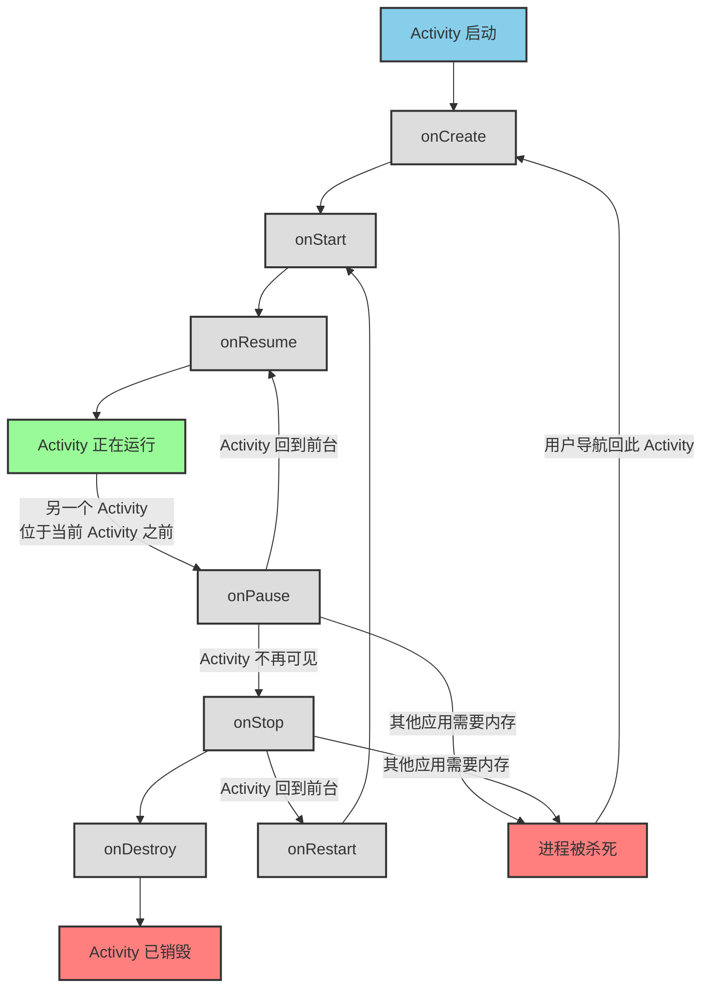

Activity（页面）是一个应用程序组件，提供一个屏幕用于交互，所有的任务都是在Activity上完成的，主Activity在AndroidManifest.xml里是这样出现的：

```xml
<activity
    android:name=".MainActivity"
    android:exported="true">
    <intent-filter>
        <action android:name="android.intent.action.MAIN" />
        <category android:name="android.intent.category.LAUNCHER" />
    </intent-filter>
</activity>
```

## 创建新的Activity

完整的Activity创建包括三个步骤：

- 在Layout目录下创建xml文件
- 创建与xml文件对应的java代码
- 在AndroidManifest.xml中注册页面配置

但实际上，在现在的Android Studio中，只需要右键项目软件包，然后选择”新建“-”Activity"-“Empty Views Activity”就可以了，Android Studio会做好一切的

## 活动页面显示与逻辑处理

Android应用利用XML标记和描绘应用界面，并使用Java（Kotlin）代码编写程序逻辑

对于任意一个Activity.java，都有一个activity.xml与之对应

我们创建一个空的MainActivity，Android Studio也会自动生成一个activity_main.xml

Android Studio生成的xml可能是这样的：

```xml
<?xml version="1.0" encoding="utf-8"?>
<androidx.constraintlayout.widget.ConstraintLayout xmlns:android="http://schemas.android.com/apk/res/android"
    xmlns:app="http://schemas.android.com/apk/res-auto"
    xmlns:tools="http://schemas.android.com/tools"
    android:id="@+id/main"
    android:layout_width="match_parent"
    android:layout_height="match_parent"
    tools:context=".MainActivity">

</androidx.constraintlayout.widget.ConstraintLayout>
```

当然，我们可以删除它提供的布局，并自己定义布局（以线性布局为例）

```xml
<?xml version="1.0" encoding="utf-8"?>
<LinearLayout
    xmlns:android="http://schemas.android.com/apk/res/android"
    android:layout_width="match_parent"
    android:layout_height="match_parent"
    android:orientation="vertical"
    android:gravity="center">

    <TextView
        android:id="@+id/textView"
        android:layout_width="wrap_content"
        android:layout_height="wrap_content"
        android:text="hello world" />

</LinearLayout>
```

需要说明的是，定义 `android:text="hello world"` 时，会跳出警告，这是因为在实际开发中，这种**赋值**类型的语句都推荐将设置的值（比如这里的text文字，也包括后文设置的Button文字）存放在 `app/res/values/strings.xml` 中，并使用 `@string/<name>` 的方式进行调用，这些值在 `string.xml` 中存放的形式如下：

```xml
<resources>
    <string name="app_name">My Application1</string>
    <string name="how_are_you">how are you?</string>
    <string name="skip_to">skip to...</string>
</resources>
```

这个时候修改MainActivity.java，添加操作部件TextView的代码：

```java
package com.example.myapplication1;

import android.os.Bundle;
import android.widget.TextView;

import androidx.appcompat.app.AppCompatActivity;

public class MainActivity extends AppCompatActivity {

    // 在onCreate方法中设置布局
    @Override
    protected void onCreate(Bundle savedInstanceState) {
        super.onCreate(savedInstanceState);
        setContentView(R.layout.activity_main);         // 设置显示的内容，这里的R类表示资源库resource
        TextView tv = findViewById(R.id.textView);      // 按id搜索内容
        tv.setText("nihao shijie!");                    // 修改内容
    }
}
```

调试app，就能看到居中的”nihao shijie!“的字样了

**总结一下：**

- Activity使用activity.xml描述页面布局
- 在Activity.java中可以使用setContentView来设置显示的内容
- 可以使用findViewById寻找到需要操作的组件

## Activity的启动与结束

假设我们需要使用按钮在Activity1中启动Activity2，那么我们首先要在Activity1中添加按钮：

```xml
<!-- Activity_main.xml -->
<Button
    android:id="@+id/jumpButton"
    android:layout_width="wrap_content"
    android:layout_height="wrap_content"
    android:text="jump to..."/>
```

然后再去源文件Activity1.java中设置事件处理setOnClickListener（就是按下按钮后要做什么），并使用Intent（意图）对象和startActivity()方法进行跳转

```java
// MainActivity1.java
Button button = findViewById(R.id.jumpButton);
button.setOnClickListener(new View.OnClickListener() {
    @Override
    public void onClick(View v) {
        // 启动Activity2
        startActivity(new Intent(MainActivity.this, MainActivity2.class));
    }
});
```

运行测试，就能看到页面上添加的“skip to...”按钮，点击它，就能跳转到Activity2了

而如果要关闭当前页面，则需要finish()方法（这里已经在Activity2中添加了按钮并设置了点击监听）：

```java
// MainActivity2.java
Button button = findViewById(R.id.backButton);
button.setOnClickListener(new View.OnClickListener() {
    @Override
    public void onClick(View v) {
        finish();
    }
});
```

## Activity的生命周期

这里的 **生命周期** ，指的是 **Activity** 从创建开始，到销毁之间的时间，及其在这段时间内进行的所有操作（比如启动另一个活动）

Activity类中有许多方法标示Activity处在生命周期的状态：

```java
public class MainActivity extends AppCompatActivity {

    private static final String TAG = "activity1";

    @Override
    // 创建活动：将页面布局加载进内存
    protected void onCreate(Bundle savedInstanceState) {
        super.onCreate(savedInstanceState);
        Log.d(TAG, "Activity onCreate");
        
        // 其他代码略
    }

    @Override
    // 启动活动：将活动页面显示在屏幕上，进入就绪状态
    protected void onStart() {
        Log.d(TAG, "Activity onStart");
        super.onStart();
    }
    
    @Override
    // 恢复活动：让处于前台的活动页面进入活跃状态，可以与用户进行交互
    protected void onResume() {
        Log.d(TAG, "Activity onResume");
        super.onResume();
    }
    
    @Override
    // 暂停活动：让页面进入暂停状态，无法与用户正常交互
    protected void onPause() {
        Log.d(TAG, "Activity onPause");
        super.onPause();
    }

    @Override
    // 停止活动：终止Activity的运行，活动页面将不在屏幕上显示
    protected void onStop() {
        Log.d(TAG, "Activity onStop");
        super.onStop();
    }

    @Override
    // 销毁活动：将活动页面从内存中清除并回收
    protected void onDestroy() {
        Log.d(TAG, "Activity onDestroy");
        super.onDestroy();
    }

    @Override
    // 重启活动：重新加载内存中的活动页面
    protected void onRestart() {
        Log.d(TAG, "Activity onRestart");
        super.onRestart();
    }
}
```

各个生命周期方法的执行流程如下图：



